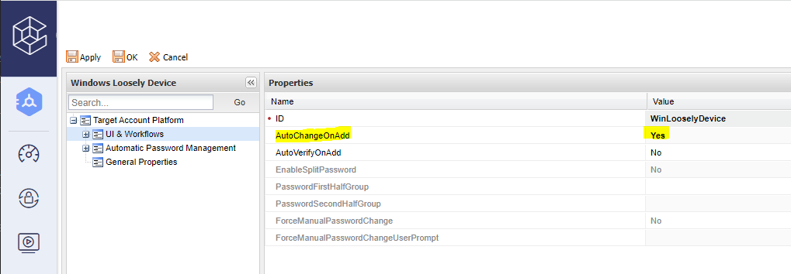
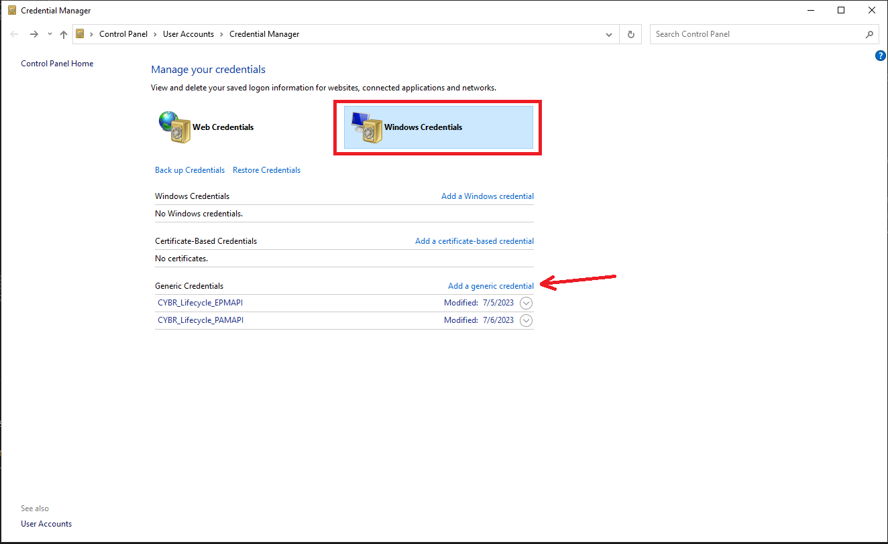
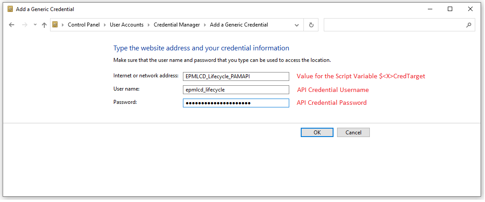
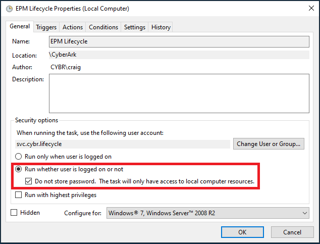
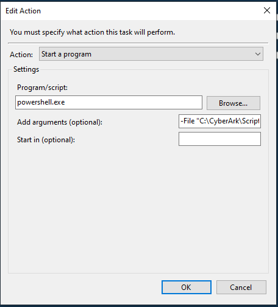
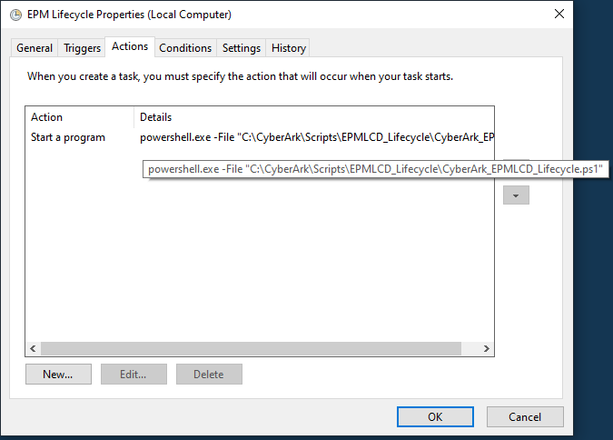
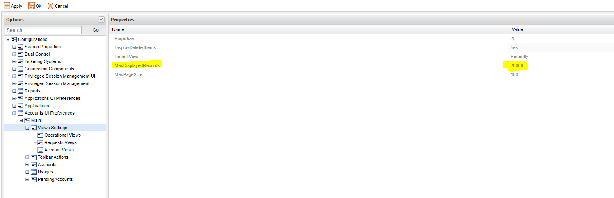
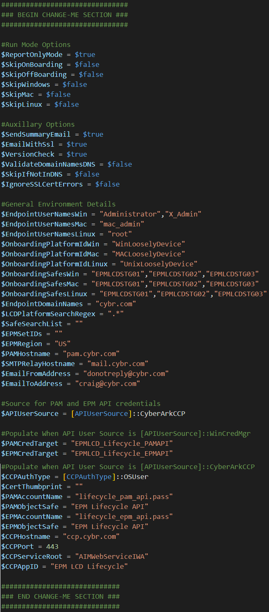
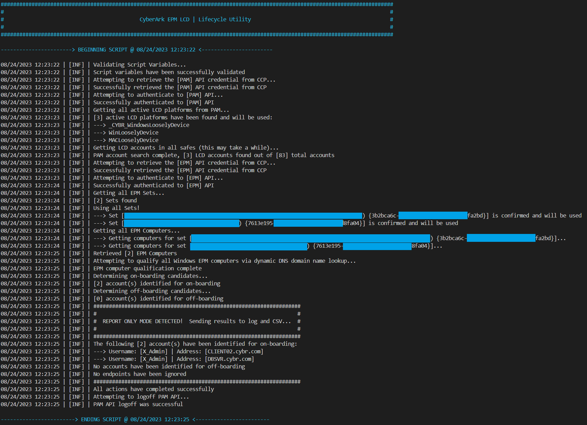

# CyberArk EPM LCD Lifecycle Utility

Organizations seeking to reduce and eliminate privilege escalation abuse, credential theft, and ransomware threats often turn to CyberArk's Endpoint Privilege Manager (EPM) for its effective suite of controls.  In concert with dialing in these least-privilege and application controls, EPM can also seamlessly integrate with CyberArk's Self-Hosted Privilege Access Management (PAM) and Privilege Cloud SaaS platforms, to provide agent-enhanced, loosely-connected, credential management capabilities for their local administrator accounts.

The design of this utility is to automate the CyberArk PAM account lifecycle for one or more standardized local accounts, on endpoints with an EPM agent.  These would be accounts that inherently exist on every endpoint of a given platform type (Windows, Mac, or Linux) as a part of its standard baseline (i.e. The Windows Built-In "Administrator").  It achieves this using data obtained exclusively from user-defined script variables, the CyberArk PAM and EPM APIs, and optionally DNS (for endpoint FQDN resolution).

The utility leverages both PAM and EPM APIs to compare the computers (agents) that exist in EPM against related local accounts that exist in PAM, automatically determining and executing the needed on-boarding and off-boarding actions in PAM.  As new agents come online in EPM, one or more standardized local accounts will be on-boarded to PAM.  Likewise as endpoints are pruned from EPM, either through organic inactivity-based attrition or proactive computer decomissioning flows, their local accounts will be off-boarded from PAM.

**This utility does not scan, discover, nor communicate directly with loosely-connected endpoints in any way.  It will NOT validate the existence of any local accounts prior to conducting on-boarding activities in CyberArk PAM!**

>**Note**: This solution is provided as-is, it is not supported by CyberArk nor an official CyberArk solution

## Features

- Complete lifecycle management (on/off-boarding) of standardized local accounts in PAM that are based on LCD
- Designed to be run interactively or via Scheduled Task from a central endpoint
- Supports separate on-boarding Safes for staging Windows, MacOS and Linux accounts
- Supports on-boarding across a pool of Safes to optimize per-Safe object counts and keep under desired limits
- Flexible Safe and Platform scoping provides continuous management throughout the account lifecycle
- Dynamic FQDN discovery via DNS for "mixed" EPM Sets that contain endpoints with varied domain memberships
- **No hard-coded secrets!**  Choice of CyberArk Central Credential Provider (CCP) or Windows Credential Manager
- Implementation of CCP supports OS User (IWA), Client Certificate, and Allowed Machines authentication
- Non-invasive Report-Only mode, useful for determining candidates for on/off-boarding, prior to go-live
- Safety mechanism to prevent sweeping changes in PAM brought by unexpected environmental changes

# Environment Setup

## Prerequisites

- One of the following CyberArk Privilege Access Management (PAM) platforms:
    - CyberArk Privilege Access Management (PAM) Self-Hosted v11.6+
    - CyberArk Privilege Cloud (Any Version)
- CyberArk Endpoint Privilege Management (EPM) SaaS
- PAM and EPM API credentials added to CyberArk PAM (CCP) or Windows Credential Manager
- PowerShell v5 or greater

>**NOTE**: For Privilege Cloud customers on the Shared Services platform (i.e. `subdomain.cyberark.cloud`), there is also a New EPM Discovery capability that will natively integrate with EPM for discovering and natively on-boarding local accounts to be managed via LCD.  For more information on this capability, see official CyberArk documentation [here](https://docs.cyberark.com/PrivCloud-SS/Latest/en/Content/Privilege%20Cloud/privCloud-accounts-discovery-service.htm)

## Deployment Overview
1. Prepare a purpose-dedicated CyberArk PAM API User - See [PAM API User Creation and Permissions](#pam-api-user-creation-and-permissions)

2. Prepare a purpose-dedicated CyberArk EPM User - See [EPM API User Creation and Permissions](#epm-api-user-creation-and-permissions)

3. Add the PAM and EPM user credentials to your choice of CyberArk PAM (CCP) or Windows Credential Manager
    - For CyberArk PAM (CCP), see [CyberArk Central Credential Provider (CCP) Considerations](#cyberark-central-credential-provider-ccp-considerations)
    - For Windows Credential Manager, see [Windows Credential Manager Considerations](#windows-credential-manager-considerations)

4. Prepare the respective LCD Platforms (Windows, MacOS, and/or Linux) that will be used for on-boarding in CyberArk PAM
    - The LCD Platform for Windows endpoints is `Windows Loosely Device` and this is available out of the box
    - The LCD Platform for MacOS is `MAC Loosely Device`, and can be downloaded from CyberArk Marketplace [here](https://cyberark-customers.force.com/mplace/s/#a3550000000El4QAAS-a3950000000jjtJAAQ)
    - The LCD Platform for Linux is `Linux Looesly Device`, and can be downloaded from CyberArk Marketplace [here](https://cyberark.my.site.com/mplace/s/#a35Ht000001pcrlIAA-a39Ht000003ztibIAA)
        - For complete instructions on importing a Platform, see official CyberArk documentation [here](https://docs.cyberark.com/PrivCloud/Latest/en/Content/PASIMP/manage-platforms.htm?tocpath=Administrators%7CManage%20platforms%7C_____0#Importaplatform)
    - Critical to the effectiveness of this solution, is ensuring these Platforms are configured for `AutoChangeOnAdd = Yes`.  See official CyberArk documentation for this Platform parameter [here](https://docs.cyberark.com/PrivCloud/Latest/en/Content/PASREF/Platform%20Mgmnt%20-%20UI%20and%20Workflows.htm)
        - For complete instructions on how to edit a Platform in order to make this configuration change, see official CyberArk documentation [here](https://docs.cyberark.com/PrivCloud/Latest/en/Content/PASIMP/manage-platforms.htm?tocpath=Administrators%7CManage%20platforms%7C_____0#Editaplatform)

    

5. Customize the script for your environment and desired outcome - See [Assigning Script Variables](#assigning-script-variables) 

6. Run the script!
    >**NOTE:** The script default is set to `$ReportOnlyMode = $true` which will result in no actions taken against CyberArk PAM.  It is **highly recommended** to maintain this run mode for the initial execution, and following any change to script variables, in order to review on-boarding and off-boarding candidates for accuracy.  Once satisfied with these results, switch to `$ReportOnlyMode = $false` to commit the respective lifecycle activities against CyberArk PAM.

7. **[OPTIONAL]** Configure the script to run on a routine basis - See [Running via Scheduled Task (Non-Interactively)](#running-via-scheduled-task-non-interactively)

## PAM API User Creation and Permissions
A purpose-dedicated user should be created in PAM for use with this utility.  For Self-Hosted PAM or Privilege Cloud Standalone, this would be a Vault Local User (leveraging CyberArk Authentication).  For Privilege Cloud Shared Services, this would be a CyberArk Identity Cloud Account (Service User).  Its username is implementer's choice, recommendation is to choose a name that is easy to identify and attribute in the CyberArk audit record as coming from this utility.

The user should be created as a "Standard user" (for Self-Hosted PAM and Privilege Cloud Standard) or otherwised added to the "Privilege Cloud Users" role (for Privilege Cloud Shared Services).  No Vault level authorizations or built-in group memberships are mandatory for this user.

For complete instructions on how to create this user, see official CyberArk documentation links below:
- [Add a User - Privilege Cloud Shared Services (i.e. subdomain.cyberark.cloud)](https://docs.cyberark.com/PrivCloud-SS/Latest/en/Content/ISPSS/ISPSS-API-Authentication.htm#Step1CreateaServiceuserforAPIrequests)
- [Add a User - Privilege Cloud Standard/Standalone (i.e. subdomain.privilegecloud.cyberark.com)](https://docs.cyberark.com/PrivCloud/Latest/en/Content/Privilege%20Cloud/privCloud-user-mng.htm?tocpath=Setup%7CAdd%20and%20manage%20users%7C_____0#CreateCyberArkusers)
- [Add a User - PAM Self-Hosted (13.2 and above)](https://docs.cyberark.com/PAS/Latest/en/Content/PASIMP/Users-groups-add-users-v10.htm?tocpath=Administrator%7CUser%20Management%7CManage%20users%20and%20groups%7CUsing%20the%20version%2010%20interface%7C_____1)
- [Add a User - PAM Self-Hosted (13.0 and below)](https://docs.cyberark.com/PAS/13.0/en/Content/PASIMP/Managing-Users.htm?tocpath=Administrator%7CUser%20Management%7C_____4#AddausertoaVault)

For Safes that will be considered for existing accounts inventory and off-boarding activity, the following privileges are required:

- Access
    - [x] List Accounts
- Account Management
    - [x] Delete Accounts

For Safes that will be considered for on-boarding activity, these being the static Windows, Mac, and Linux safes named in the `$OnboardingSafesWin`, `$OnboardingSafesMac`, and `$OnboardingSafesLinux` Script Variables (See the [Assigning Script Variables](#assigning-script-variables) section below for more info), the following privileges are required:

- Access
    - [x] List Accounts
- Account Management
    - [x] Add Accounts
    - [x] Update Account Properties
    - [x] Update Account Content*
    - [x] Initiate CPM Account Management Operations
    - [x] Delete Accounts**

>`* ` - Specifically required for un-delete scenarios<br/>
>`**` - Required if this safe should also be considered for off-boarding

For complete instructions on how to permission a Safe, see official CyberArk documentation links below:
- [Add Safe Members - Privilege Cloud Shared Services (i.e. subdomain.cyberark.cloud)](https://docs.cyberark.com/PrivCloud-SS/Latest/en/Content/Privilege%20Cloud/privCloud-manage-safe-members.htm#AddSafemembers)
- [Add Safe Members - Privilege Cloud Standard/Standalone (i.e. subdomain.privilegecloud.cyberark.com)](https://docs.cyberark.com/PrivCloud/Latest/en/Content/Privilege%20Cloud/privCloud-manage-safe-members.htm?tocpath=Administrators%7CCreate%20Safes%20and%20assign%20access%7C_____2#AddSafemembers)
- [Add Safe Members - PAM Self-Hosted](https://docs.cyberark.com/PAS/Latest/en/Content/PASIMP/Safes-add-a-safe-member-V12-6.htm?tocpath=Administrator%7CPrivileged%20Accounts%7CAccess%20Control%7CSafes%20and%20Safe%20members%7CNew%20interface%7C_____3#AddaSafemember1)

## EPM API User Creation and Permissions
A purpose-dedicated login to your EPM tenant is recommended for use with this utility.  At this time there are limited options for creating API-dedicated logins in EPM since logins require E-Mail activation and the login must also remain unique.  To overcome this limitation, you might consider establishing an organizational mailbox for this account, if viable.  Alternatively, the same E-Mail of an existing login may be used in the creation of a new and unique login through the plus addressing technique:

Existing Login Example Email - john.doe@company.com <br/>
New Login Example Email - john.doe+lcd_lifecycle@company.com <br/>

Using a login value as in the above "new" example, would send the activation E-Mail to john.doe@company.com, without impacting the existing john.doe@company.com login.

The login you create for this utility only needs marked as **"Allow to manage Sets"** along with **"View Only Set Admin"** bindings on any Sets that will be in scope for this utility.

This utility does not require any modifying access to EPM.

For complete instructions on how to create a user in EPM, see official CyberArk documentation [here](https://docs.cyberark.com/EPM/Latest/en/Content/Admin/AccountAdministrator.htm#Managesetusers).

## CyberArk Central Credential Provider (CCP) Considerations
Leveraging CyberArk PAM as the credential store for the PAM and EPM API credentials is recommended wherein available, as this allows for management of these API credentials without ever needing to modify the utility's host or the solution itself!  If you are uncertain whether you have CCP licensing or this capability established in your environment, reach out to your CyberArk account team.

When leveraging CCP, a purpose-dedicated application entry should be created in CyberArk.

The CCP integration with this utility supports the choice of OS User, Client Certificate or Allowed Machines authentication mechanisms to the CCP.  Allowed Machines authentication may also be implemented as an additional layer to OS User and Client Certificate authentication in the CyberArk application configuration if so desired.

When implementing Client Certificate authentication, the certificate you wish to use should be installed in the local machine's personal certificate store.  Note that this utility does not need to be (and should not be) run with administrative privileges.  As a result, it may be necessary to delegate explicit permissions to the client certificate's private key for the executing context.  This may be required for a standard user when running interactively, or for a local service when implementing non-interactively via a Scheduled Task.  The script will notify you via log and console output during execution, if you lack permissions to the certificate's private key.

To delegate permissions to the certificate's private key, open the local machine's certificates snap-in (certlm.msc) and do the following:

1. Right-Click on the Client Certificate and navigate to "All Tasks" > "Manage Private Keys..."

2. Add the script's executing context to the Access Control List (ACL) and grant "Read" permissions

For general information on the CyberArk Central Credential Provider (CCP), please refer to CyberArk's official documentation [here](https://docs.cyberark.com/AAM-CP/Latest/en/Content/CCP/The-Central%20-Credential-Provider.htm)

For guidance on configuring CCP for OS User authentication, see CyberArk's official documentation [here](https://docs.cyberark.com/AAM-CP/Latest/en/Content/CCP/Configure_CCPWindows.htm#ConfigureWindowsDomainAuthentication)

For guidance on configuring CCP for Certificate authentication, see CyberArk's official documentation [here](https://docs.cyberark.com/AAM-CP/Latest/en/Content/CCP/Configure_CCPWindows.htm#SecurecommunicationbetweenapplicationsandtheCentralCredentialProvider)

## Windows Credential Manager Considerations
When choosing to leverage the Windows Credential Manager, each API credential must be manually added to the Credential Manager under the user context that intends to execute the utility.  This may be your standard interactive user, or a purpose-dedicated service account that has been logged in interactively to complete these steps.

>**NOTE:** The Windows Credential Manager UI allows for secure creation or update of credentials but does not provide a direct means of retrieving the clear-text credential by design.

To open the Credential Manager, navigate to `Control Panel > Credential Manager` or "Run" (WinKey + R) to launch `"Control keymgr.dll"`. 


Two credentials should be added, one corresponding to the PAM API, and one corresponding to the EPM API.  

Each credential should be entered via `Windows Credentials > "Add a generic credential"`.



You must populate all three fields:  

- The value for field `"Internet or network address"` should be populated with the ID/label that will be assigned to the `$PAMCredTarget` or `$EPMCredTarget` script variables respectively (See the [Assigning Script Variables](#assigning-script-variables) section below).

- The value for field `"User name"` should contain the actual API credential's Username value

- The value for field `"Password"` should contain the actual API credential's Password value
 


In the populated example shown above, if we consider this as the PAM API credential, then `$PAMCredTarget` would need to be set as follows:
```powershell 
$PAMCredTarget = "EPMLCD_Lifecycle_PAMAPI"
```

## Running via Scheduled Task (Non-Interactively)
In general, the setup of a scheduled task to run this utility on a periodic basis (time based trigger) is very straight forward.   The options for the user that is assigned to run this scheduled task depends on whether CyberArk PAM (CCP) or the Windows Credential Manager are used as the store for the PAM and API credentials.

When using `CyberArk PAM (CCP)` as the credential store, and when using:

- `Client Certificate` (and/or Allowed Machines) Authentication
    - The task may simply run as the `LOCAL SERVICE` account, with permissions being appropriately delegated to the client certificate's private key, as described in the section [CyberArk Central Credential Manager (CCP) Considerations](#cyberark-central-credential-provider-ccp-considerations) above.

- `OS User` Authentication
    - The task may run as `NETWORK SERVICE`, a named domain (traditional) service account, or as a Group-Managed Service Account (gMSA).  When running as `NETWORK SERVICE`, the OS User entry on the CyberArk Application defined for this solution should be set to `<NB_DOMAIN_NAME>\<HOSTNAME>$`.  For example if the NetBIOS Domain Name was "CYBR" and the host's computer name was "CPM", then the OS User entry on the CyberArk Application defined for this solution should be `CYBR\CPM$`

When using `Windows Credential Manager` as the credential store:

- The task must run as a named local or domain (traditional) service account user that has temporary means to login to the solution host interactively, in order to populate the needed Credential Manager entries.  Once the Credential Manager has been populated for the service user as described above (see [Windows Credential Manager Considerations](#windows-credential-manager-considerations)), interactive login (both locally and via remote desktop services) may be explicitly denied for the named service account.  Batch logon (the `"Log on as a batch job"` user rights assignment) is the only logon type required for execution via Scheduled Task.

The Task should be created to `"Run whether user is logged on or not"` and set to `"Do not store password"` when configuring with a traditional service account.  These settings are not applicable when using `LOCAL SERVICE` or `NETWORK SERVICE` as your executing context.

The Task action should be set to start a program (`"powershell.exe"`) with the following arguments:

```
-File <PATH_TO_SCRIPT_FILE>
```

An "On a Schedule" task trigger may be defined.  The task may also be run on demand.

A successful script execution will return with code `"0"` which will show in Task Scheduler's last run result as `"The operation has completed successfully (0x0)"`.  Any unexpected failure of the script, will return with a code of `"1"` (0x1)

>**NOTE:** There will not be any interactive console output when running this utility from a Scheduled Task.  Instead, each execution will create and populate a log file under a solution-created `"Logs"` subfolder, which will be in the same directory that contains the solution's script file.  It is important that you ensure the executing context of this Scheduled Task has the needed NTFS permissions for this log file to be created!  You should refer to these log files for more details pertaining to the task's execution and any relative success or failure.

Screenshot examples of how this task might be setup, when run under a traditional service account named here as "svc.cybr.lifecycle" can be seen below:







## Assigning Script Variables
There are a series of script variables that must be set off default, to values that are pertinent to your executing environment.  These variables are declared in the `SCRIPT VARIABLES` region at the top of the script between the `### BEGIN CHANGE-ME SECTION ###` and `### END CHANGE-ME SECTION ###` comment markers:

### Run Mode Options
- `$ReportOnlyMode`
    - When set to `$true` will report in console, log, and CSV, which accounts would be on-boarded to, and/or off-boarded from, PAM. **This is a read-only run mode!**
- `$SkipOnBoarding`
    - When set to `$true` will skip the on-boarding logic.
- `$SkipOffBoarding`
    - When set to `$true` will skip the off-boarding logic.
- `$SkipWindows`
    - When set to `$true` will skip lifecycle management for Windows-based accounts and endpoints.
- `$SkipMac`
    - When set to `$true` will skip lifecycle management for MacOS-based accounts and endpoints.
- `$SkipLinux`
    - When set to `$true` will skip lifecycle management for Linux-based accounts and endpoints.

### Auxillary Options
- `$SendSummaryEmail`
    - When set to `$true` will send an execution summary E-Mail to the recipient configured in `$EmailToAddress`.
- `$EmailWithSsl`
    - When set to `$true` will send the execution summary E-Mail using SSL/TLS.
- `$VersionCheck`
    - When set to `$true` will compare to the latest script available on GitHub and log/notify if a new version is available.
- `$ValidateDomainNamesDNS`
    - When set to `$true` will leverage DNS lookups to attempt discovery of EPM endpoint FQDNs for on-boarding accuracy.
    Used with `$EndpointDomainNames` (See entry above for more details).
    Used with `$SkipIfNotInDNS` (See entry below for more details).
- `$SkipIfNotInDNS`
    - When set to `$true` will skip candidacy for any EPM Endpoints that cannot be explicitly resolved in DNS.  When set to `$false`, endpoints in EPM that cannot be DNS resolved, will be considered "domain-less" for lifecycle candidacy.  Only used when `$ValidateDomainNamesDNS` is set to `$true`, otherwise this can be ignored.
- `$IgnoreSSLCertErrors`
    - When set to `$true` will ignore any TLS/SSL untrusted certificate errors that would normally prevent the connection. It is recommended to leave this value as `$false` to ensure certificates are verified!

### General Environment Details
- `$EndpointUserNamesWin`
    - List of one or more local account usernames to lifecycle manage for all Windows-based EPM endpoints.
- `$EndpointUserNamesMac`
    - List of one or more local account usernames to lifecycle manage for all Mac-based EPM endpoints.
- `$EndpointUserNamesLinux`
    - List of one or more local account usernames to lifecycle manage for all Linux-based EPM endpoints.<br/><br/>
    >**NOTE:** There is no detection or validation of an account's existence on the respective endpoints!  An account will be on-boarded to PAM for each username provided in this list, and for every Windows/MacOS/Linux endpoint, regardless if it actually exists on a given endpoint or not.
- `$EndpointDomainNames`
    - List of one or more DNS domain names that EPM endpoints have membership to. Applicable only for Windows endpoints as Mac/Linux endpoints are assumed to have an incorporated domain/DNS suffix (if any). Used with `$ValidateDomainNamesDNS` and `$SkipIfNotInDNS` -- See below for complete info on these variables.
        - If `$ValidateDomainNamesDNS` is set to `$false`, `$EndpointDomainNames` must be set to a single domain name or empty (i.e. "").  
        - If `$ValidateDomainNamesDNS` is set to `$true`, `$EndpointDomainNames` may remain empty, contain a single domain name, or contain multiple domain names.  
        - If `$ValidateDomainNamesDNS` is set to `$true` and `$EndpointDomainNames` is empty, the DNS Client's Suffix Search List will be used.

        <br/>
        Valid Examples / Scenarios:
        <br/>
        
        Disable Domain Name resolution via DNS and consider all EPM endpoints as having a standard domain-name of "cybr.com":
        ```powershell
        $EndpointDomainNames = "cybr.com"
        $ValidateDomainNamesDNS = $false
        ```

        Disable Domain Name resolution via DNS and consider all EPM endpoints as having no domain name:
        ```powershell
        $EndpointDomainNames = ""
        $ValidateDomainNamesDNS = $false
        ```
                            
        Enable Domain Name resolution via DNS and consider EPM endpoints WILL have membership in one of several possible domain names (will skip candidacy if unable to resolve in DNS):
        ```powershell
        $EndpointDomainNames = @("cybr.com", "childA.cybr.com", "childB.cybr.com")
        $ValidateDomainNamesDNS = $true
        $SkipIfNotInDNS = $true
        ```

        Enable Domain Name resolution via DNS and consider EPM endpoints MAY have membership in one of several possible domain names or are otherwise domain-less (Will assume no domain name for candidacy, if unable to resolve in DNS):
        ```powershell
        $EndpointDomainNames = @("cybr.com", "childA.cybr.com", "childB.cybr.com")
        $ValidateDomainNamesDNS = $true
        $SkipIfNotInDNS = $false
        ```

- `$OnboardingPlatformIdWin`
    - Platform ID for the platform to use when on-boarding Windows LCD accounts.
- `$OnboardingPlatformIdMac`
    - Platform ID for the platform to use when on-boarding MacOS LCD accounts.
- `$OnboardingPlatformIdLinux`
    - Platform ID for the platform to use when on-boarding Linux LCD accounts.
- `$OnboardingSafesWin`
    - A list of one or more Safes that Windows LCD accounts will be on-boarded into.
- `$OnboardingSafesMac`
    - A list of one or more Safes that MacOS LCD accounts will be on-boarded into.
- `$OnboardingSafesLinux`
    - A list of one or more Safes that Linux LCD accounts will be on-boarded into.
- `$LCDPlatformSearchRegex`
    - Regular expression for determining which accounts, as assigned to the regex matched LCD-derived platforms, should be considered "in scope" for making off-boarding determinations.  Used in more advanced setups that require silo'd scopes, for running multiple script processes against different EPM sets (See section [Advanced Domain Name EPM Set Targeting and Process Scoping](#advanced-domain-name-epm-set-targeting-and-process-scoping)).  In most situations the default value of ".*" will be sufficient.
- `$SafeSearchList`
    - List of CyberArk Safes which will be searched for existing LCD accounts in PAM, when determining lifecycle candidates.  May be left empty (i.e. "") to search all safes. <br/><br/>
    
    >**NOTE:** The PAM API user's permissions will also dictate, and may limit, which Safes can and will be searched!
- `$EPMSetIDs`
    - List of the EPM Set IDs to use for this process.  May be left empty (i.e. "") to use all Sets within the EPM tenant.
- `$EPMRegion`
    - The region of your EPM SaaS tenant.  Must be set to one of the following values:  US, AU, CA, EU, IN, IT, JP, SG, UK, or BETA
- `$PAMHostname`
    - The base hostname of the Self-Hosted PAM or Privilege Cloud (i.e. "subdomain.privilegecloud.cyberark.com" or "subdomain.cyberark.cloud")
- `$SMTPRelayHostname`
    - The hostname (FQDN or IP) of the SMTP relay you would like to send the execution summary E-Mail.
- `$EmailFromAddress`
    - The "From" address to be used when sending the execution summary E-Mail.
- `$EmailToAddress`
    - The "To" recipient to use when sending the execution summary E-Mail.

### Source for PAM and EPM API credentials
- `$APIUserSource`
    - Determines the source for PAM and EPM API credential lookup.  There are two possible settings:

        ```powershell
        [APIUserSource]::CyberArkCCP
        ```
        Will use CyberArk Central Credential Provider for API credential lookup **[RECOMMENDED]**

        ```powershell
        [APIUserSource]::WinCredMgr
        ```
        Will use the Windows Credential Manager for API credential lookup

        CyberArk CCP is generally recommended wherein available, as this simplifies solution setup and allows for regular credential rotation for the API users without the need to update any configuration points on the solution's host.

### Populated When API User Source is `[APIUserSource]::WinCredMgr`
- `$PAMCredTarget`
    - The "Internet or network address" value that was used when entering the `PAM` API credential into Windows Credential Manager.  
- `$EPMCredTarget`
    - The "Internet or network address" value that was used when entering the `EPM` API credential into Windows Credential Manager.
    
### Populated when API User Source is `[APIUSerSource]::CyberArkCCP`
- `$CCPAuthType`
    - Determines the authentication type against CCP when used as the API user source.  There are three possible settings:

        ```powershell
        [CCPAuthType]::OSUser
        ```
        Will use OS User (Integrated Windows Authentication) to authenticate to the CCP **[RECOMMENDED]** 

        ```powershell
        [CCPAuthType]::Certificate
        ```
        Will use Client Certificate to authenticate to the CCP **[RECOMMENDED]** 

        ```powershell
        [CCPAuthType]::AllowedMachines
        ```
        Will depend solely upon an allowed machines listing in CyberArk for authentication

        >**NOTE:**  Allowed Machines authentication may be layered on to OSUser or Certificate based authentication in the CyberArk configuration.  

- `$CertThumbprint`
    - The SHA1 thumbprint of the client certificate to use for authentication to CCP.
- `$PAMAccountName`
    - The account name (aka object name) of the vaulted account that represents the PAM API credential.
- `$PAMObjectSafe`
    - The Safe where the vaulted account that represents the PAM API credential is held in CyberArk.
- `$EPMAccountName`
    - The account name (aka object name) of the vaulted account that represents the EPM API credential.
- `$EPMObjectSafe`
    - The Safe where the vaulted account that represents the EPM API credential is held in CyberArk.
- `$CCPHostname`
    - The base hostname of the CyberArk CCP (i.e. "ccp.cybr.com")  
- `$CCPPort`
    - The port number for the CyberArk CCP listener (i.e. 443)
- `$CCPServiceRoot`
    - The IIS application/service root that should be used for the web call to CCP (i.e. AIMWebService).
- `$CCPAppID`
    - The Application ID registered in CyberArk that should be used identification to CCP.

# General Usage and Advanced Techniques

## Safety Mechanism
By design, this utility has the potential to make sweeping changes to the PAM account landscape.  Ideally, we desire to accommodate the situations that are reasonably expected and to likewise prevent those that might not be.  An example of an expected situation would be during the initial setup of this very utility.  An example of an unexpected situation might be the sudden change in privileges of the API user(s), which could result in a mass on-boarding of duplicates or mass off-boarding of accounts, brought by the API user's lack of proper visibility into its respective API.  To account for the unexpected, a safety mechanism has been provided.

The quantity of PAM Accounts (LCD) and EPM Computers as obtained from the previous successful execution, are maintained in a DAT file that is co-located with the script `CyberArk_EPMLCD_Lifecycle.dat`.  When this baseline is compared against values obtained during the current execution, if there is a change delta that's greater than the defined threshold, the script will either warn you (when in report-only mode) or abort execution entirely to prevent sweeping changes in PAM.

By default, the thresholds for PAM Accounts and EPM Computers are set to **<u>10%</u>** (`0.10`), but these values can be adjusted by changing the definition of the following Script Variables:

```powershell
$SafetyThresholdPAM = 0.10
$SafetyThresholdEPM = 0.10
```

For most environments, these default values should provide adequate safety however it may be necessary to adjust to better suit your environmental needs.  If you are managing LCD accounts outside of this utility for example, it may be necessary to increase the PAM threshold to buffer those activities.  And depending on your environment's overall size, larger or smaller thresholds may be desirable; only you know your expected rate of change best!

Additionally, you may review the output provided in report-only mode and determine that the expected on/off-boarding actions are appropriate, despite having triggered the safety.  In this situation, you have three options:

1. Increase the respective threshold, if just temporarily, to allow execution to proceed

2. Delete the `CyberArk_EPMLCD_Lifecycle.dat` file, which will trigger a new baseline capture.  This can also be done while remaining in Report-Only mode to ensure once more, that the expected actions are appropriate

3. Disable the safety mechanism entirely by setting `$EnableSafety = $false` in the Script Variables section

It is generally **not recommended** to disable the safety mechanism for any extended period, but this option remains available in case no amount of threshold tuning would be suitable for the given environment or use-cases presenting.

## Safe Pooling
Although there is no documented technical ceiling for the quantity of account objects that a Safe can hold, it is a good rule of thumb to keep this quantity to `30,000` or fewer to maintain optimal performance parameters in PAM. 

For LCD environments with an endpoint footprint that exceeds this volume, being constrained to a single on-boarding Safe would be problematic.  To address this, the utility allows you to leverage a scalable pool of Safes for on-boarding, by simply listing more than one Safe.  This list may be separate, or the same, for each platform type (i.e. Windows or MacOS).  

Consider the following example:

```powershell
$OnboardingSafesWin = "EPMLCDWin01","EPMLCDWin02","EPMLCDWin03"
$OnboardingSafesMac = "EPMLCDMac01","EPMLCDMac02","EPMLCDMac03"
```

This configuration establishes 3 Safes for on-boarding distribution, and uniquely for each platform type.

During the on-boarding motion, the utility will automatically analyze the current account quantities in all Safes for the respective pool and leverage the Safe with the lowest quantity of accounts for each candidate that is considered for on-boarding.  If all Safes are at an even quantity, the distribution will follow a round-robin on-boarding pattern.

If you wish to add another Safe as you scale up your deployment, you may do so at any time, by simply adding a new Safe to PAM, ensuring you add the solution's API user with appropriate privileges, and then adding this to the end of the list in the respective script variable.  During the next and subsequent executions, on-boarding will prefer this Safe until it reaches equilibrium with other Safes in the pool.

The utility will <u>warn</u> you if all Safes would exceed `28,000` accounts as a result of an on-boarding motion and will <u>**abort**</u> the on-boarding motion entirely, prior to initiating, if all Safes would exceed `30,000` accounts.

## Logging and Reporting
Being designed to run both interactively and non-interactively, this utility automatically generates log files during each execution.  Log files will follow a naming convention of `<SCRIPT NAME>_<CURRENT DATE/TIME IN MM-dd-yyyy_HHmmss>.log`.  These log files are created in a `"Logs"` subfolder which will be created by the utility if it does not exist, in the same directory that contains the script file.

A CSV report is generated containing all accounts that are candidates for on/off-boarding when running in Report-Only mode.  When running in production mode, the report will contain all accounts wherein on/off-boarding was attempted, along with its success or failure.  These reports are intended to simplify any subsequent data processing and review over lifecycle activities.  Report files will follow a naming convention of `<SCRIPT_NAME>_<CURRENT DATE/TIME IN MM-dd-yyyy_HHmmss>.csv` for standard executions, and will include a `_RO.csv` tail for Report-Only executions.  These CSV reports are created automatically in a `"Reports"` subfolder, which will be created by the utility if it does not exist, in the same directory that contains the script file.  A report file will not be persisted, if it would contain no entries (i.e. executions where no accounts were identified as candidates for on/off-boarding).

>**NOTE:** The script will immediately abort if the log file or report file cannot be created!  As a result, it is important you ensure that the executing security principal (e.g. user or service account) has the necessary NTFS permissions in the script's directory to create the Logs and Reports folder, along with the respective files within.  Run the script interactively to observe the error you're receiving in console if this should occur.

In addition to the log and report files which will always be generated, this utility may also optionally send an execution summary via E-Mail.  This feature can be enabled by setting:

```powershell
$SendSummaryEmail = $true
```

Along with the supporting E-Mail varaibles that determine FROM address, TO address, and which host the E-Mail should be relayed for exchange routing.  

The execution summary E-Mail will contain basic details about the execution in both the subject line and body, to include:

- Whether a new version of the utility is available on GitHub (if `$VersionCheck` is enabled)
- Whether the execution mode was Report-Only
- Overall success or failure of the execution
- Execution start datetime, end datetime, and run duration (in HH:MM:SS)
- Quantity of accounts that were successfully (or would be) on/off-boarded
- Quantity of accounts that failed to on/off-board (if any)
- Whether or not the safety mechanism was triggered

Further detail regarding any specific errors or failures will usually be obtainable from the respective execution's log and report files which remain on the utility's host, and will be path-referenced in the execution summary E-Mail when such a failure situation occurs.

>**NOTE:** The technique leverages PowerShell's native `Send-MailMessage` cmdlet which has been designated as deprecated by Microsoft, and without a suitable replacement being provided natively in .NET.  Even so, this cmdlet should remain adequate for anonymous transmission via internal mail gateways, which should naturally align to its intended use.

## Advanced Domain Name EPM Set Targeting and Process Scoping
At present, the EPM API does not provide an endpoint's affiliated domain name.  However, determining an endpoint's domain name, and thus its fully qualified domain name (FQDN), is critical to on-boarding accuracy and ensuring the endpoint's LCD mechanism finds an appropriate match in PAM.  To account for this, we have two primary options for discovering or appending possible domain names:

1. We can attempt to discover the domain name via DNS against a set of possible domain names

2. We can assert a static and known domain name for all endpoints that are in scope of the running utility process (e.g. EPM Sets)

In scenarios wherein all possible Windows endpoints across all possible EPM Sets, will always be members of a single known domain name, we can easily achieve the desired result with a single utility process by disabling Dynamic resolution (`$ValidateDomainNamesDNS = $false`) and defining our domain name to the script accordingly.   However, wherein EPM agents may be deployed across endpoints that hold membership in a diverse spread of varied domains, and wherein domain name resolution via DNS is also not possible or otherwise deemed unreliable, another approach is required.

This utility supports multiple processes to be defined and executed in parallel, working through the use of strategic EPM Set design and PAM Platform alignment, to support accurate domain name mapping in multi-domain environments.

Illustrated below is a two-domain example where EPM contains endpoints may have membership in either DomainA.com or DomainB.net, and the steps for how to approach:

1. If not already established, separate endpoints into unique EPM Sets, each pertaining to their respective domain.  
    - Consider endpoints for example, with membership in `DomainA.com` as belonging to EPM Set Id `{abc123}` and endpoints with membership in `DomainB.net` as belonging to EPM Set Id `{xzy987}`.

2. Create separate LCD platforms for each domain using a regex-friendly naming convention
    - Consider endpoints for example, with membership in `DomainA.com` as targeting one or more platforms beginning with `_CYBR_LCD_SetA_` and endpoints with membership in `DomainB.net` as targeting one or more platforms named `_CYBR_LCD_SetB_`

3. Configure separate utility processes (e.g. Scheduled Tasks) with the following uniquely defined variables:

    - DomainA
        ```Powershell
        ...
        $OnboardingPlatformIdWin = "_CYBR_LCD_SetA_Windows"
        $LCDPlatformSearchRegex = "^_CYBR_LCD_SetA_.*$"
        $EPMSetIDs = "{abc123}"
        ...
        ```
    - DomainB
        ```powershell
        ...
        $OnboardingPlatformIdWin = "_CYBR_LCD_SetB_Windows"
        $LCDPlatformSearchRegex = "^_CYBR_LCD_SetB_.*$"
        $EPMSetIDs = "{xyz987}"
        ...
        ```
These settings will ensure that lifecycle candidacy remains effectively silo'd for each process (thanks to the unique EPM Set and Platform(s) that each process will leverage) and will prevent false off-boarding for accounts that are being authoritatively lifecycle managed through a neighboring process.

# Limitations and Known Issues
## The utility is only returning 20,000 accounts when searching PAM
Although the CyberArk PAM API supports a paginated return, the [Get Accounts](https://docs.cyberark.com/PAS/Latest/en/Content/SDK/GetAccounts.htm?tocpath=Developer%7CREST%20APIs%7CAccounts%7C_____1) endpoint is bound by an upper limit of `20,000` accounts by default.  This is upper limit is functionally tied to the `MaxDisplayedRecords` Parameter in PAM's configuration under `Administration > Options > Accounts UI Preferences > Main > View Settings`.  If the number of LCD accounts in your deployment would exceed 20,000 you must increase this value to meet or exceed your LCD account target for this utility to function correctly.

>**NOTE:** This setting also affects the PAM Web UI (Password Vault Web Access), so it is recommended to increase in increments, and closely monitor Web UI performance following each change to ensure this does not detrimentally affect your environment's performance.

See the following CyberArk Knowledge Base (KB) article that describes making this change [here](https://cyberark-customers.force.com/s/article/PVWA-All-accounts-only-show-up-to-20000-records)



If you are interested in having this upper limit bound to another configuration parameter (as to not consequentially affect the Web UI), or to be eliminated entirely, you might consider adding your up-vote to the CyberArk Enhancement Request (ER) [here](https://cyberark-customers.force.com/s/article/Allow-REST-API-request-more-accounts-than-the-MaxDisplayedRecords-EQAQ)

>**NOTE:** Up-voting ERs requires a CyberArk Technical Community Login

## ERROR: *Failed to get LCD derived platforms --> "...The given key was not present in the dictionary..."*
Presence of this error may indicate a backend configuration disparity with CyberArk Platforms.  See the following CyberArk Knowledge Base (KB) article for details on how to possibly resolve this [here](https://cyberark-customers.force.com/s/article/pCloud-Get-Platforms-API-returns-CAWS00001E-The-given-key-was-not-present-in-the-dictionary)

## PowerShell ISE Logging
The script has been shown to experience intermittent issues writing to the log file, due to file locks, when running from within PowerShell ISE.  Therefore it is highly recommended that when running this script interactively, it be done from a standard PowerShell prompt and not from within PowerShell ISE.

## Fully Qualified Domain Name (FQDN) Reliability
As mentioned in the [Advanced Domain Name EPM Set Targeting and Process Scoping](#Advanced-Domain-Name-EPM-Set-Targeting-and-Process-Scoping) section above, the EPM API does not presently provide the FQDN nor DNS Suffix for Windows endpoints.  

The FQDN for Windows endpoints is a required data point for PAM on-boarding and its accuracy is critical for ensuring the LCD mechanism will engage for these endpoints.  This utility can be configured to utilize the same, static, DNS suffix for all Windows endpoints, or to utilize DNS to resolve an endpoint's FQDN (potentially useful for mixed domain environments).  Unfortunately, neither solution may provide for a reliable or complete solution in every environment.  The objectively ideal outcome would be for the EPM API to simply provide this data point for us authoritatively.

If you would like to see the EPM API provide the FQDN (or DNS Suffix) for endpoints, please show your support by adding your vote to [this Enhancement Request (ER)](https://cyberark.my.site.com/s/article/EPM-API-to-provide-FQDN-of-computer-endpoints-c6f9-c8f)

>**NOTE:** Up-voting ERs requires a CyberArk Technical Community Login

# Interactive Output Example

```powershell
CyberArk_EPMLCD_Lifecycle.ps1
```
The example scenario below is configured with the following environment-specific considerations and preferences:

## Example Setup and Scenario (Script Variable Preparation)

- Report-Only Mode is Enabled, so **<u>no actual on/off-boarding</u>** will take place during this execution
- An execution summary e-mail will be sent
- We will use all sets in EPM
- The EPM Region/Datacenter is US
- All Safes that the PAM API user has access to, will be searched for existing LCD accounts
- Named accounts that will exist on every Windows endpoint are `Administrator` and `X_Admin`
- The named account that will exist on every Mac endpoint is `mac_admin`
- The named account that will exist on every Linux endpoint is `root`
- The default Platforms will be used for on-boarding
- The Safe pool in CyberArk PAM that will be used for on-boarding is named `EPMLCDSTG01, EPMLCDSTG02, and EPMLCDSTG02`
- The PAM Self-Hosted PVWA hostname for this environment is `pam.cybr.com` (i.e. https://`pam.cybr.com`/PasswordVault)
- We will not use DNS lookup to determine Windows endpoint FQDN.
    - We will assume a DNS suffix of `cybr.com` for all Windows endpoints.
- Use CyberArk PAM (CCP) to retrieve the PAM and EPM API credentials
     - The CCP's hostname is `ccp.cybr.com` (i.e. https://`ccp.cybr.com`/AIMWebService/...)
- Use OS User Authentication for CCP against a unique CCP service root of `AIMWebServiceIWA`



## Example Outputs and Result

- Three (3) EPM Computers [Windows Platform] were found across three (3) EPM Sets; hostnames of `CLIENT02`, `DBSVR` and `WINTGT`
- All EPM Computers were DNS suffix appended to FQDN `CLIENT02.cybr.com`, `DBSVR.cybr.com`, and `WINTGT.cybr.com`
- Four (4) LCD-based accounts out of eighty-six (86) total accounts were found as existing in PAM - these are:
    - `Administrator` for `CLIENT02.cybr.com`
    - `Administrator` for `CLIENT03.cybr.com` 
    - `Administrator` for `DBSVR.cybr.com`
    - `AppAdmin1` for `CLIENT03.cybr.com`
- `X_Admin` is missing in PAM for all three EPM computers, and should be on-boarded
- `Administrator` for `WINTGT.cybr.com` is also missing in PAM, and should be on-boarded
- `CLIENT03` does not exist in EPM and so its managed account entry for `Administrator` should be off-boarded from PAM
- `AppAdmin1` is not a username listed in `$EndpointUserNamesWin`.  It's expected that this account was on-boarded outside of this utility for a specific application role, and is out of scope for this utility.  It will **not** be off-boarded despite there being no corresponding computer object for it in EPM




# Support

This project is neither developed nor supported by CyberArk; any official support channels offered by the vendor are not appropriate for seeking help with the implementation or function of this solution.

Help and support should be sought by [opening an issue][new-issue].

[new-issue]: https://github.com/cgeneske/CyberArkEPMLCDLifecycle/issues/new

# License

This project is [licensed under the MIT License](LICENSE.md).