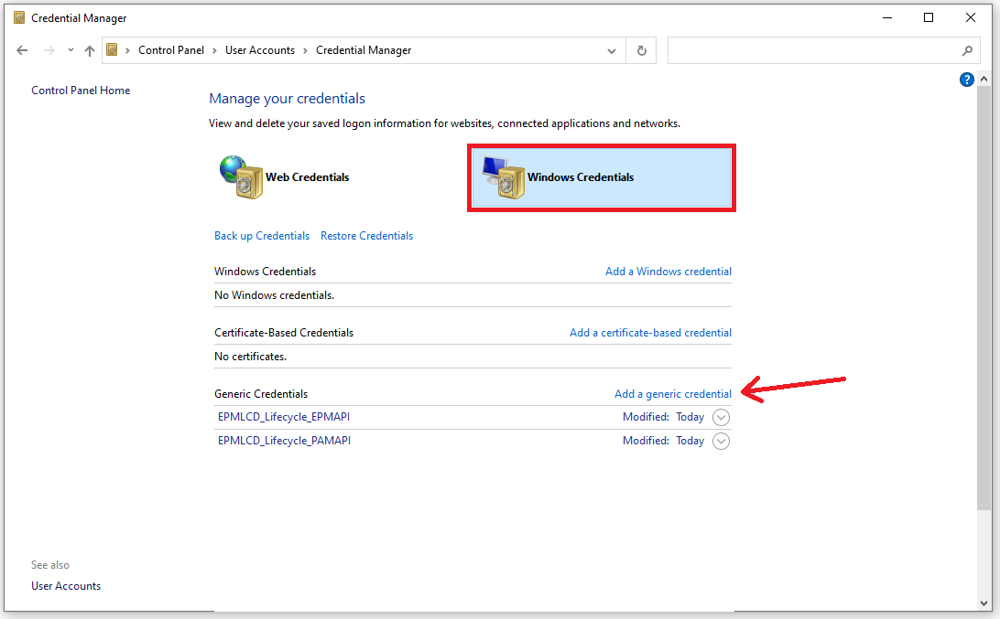

# CyberArk EPM LCD Lifecycle Utility

Organizations seeking to reduce and eliminate privilege escalation abuse, credential theft, and ransomware threats often turn to CyberArk's Endpoint Privilege Manager (EPM) for its effective suite of controls.  In concert with dialing in these least-privilege and application controls, EPM can also seamlessly integrate with CyberArk's Self-Hosted Privilege Access Management (PAM) and Privilege Cloud SaaS platforms, to provide agent-enhanced, loosely-connected, credential management capabilities for their local administrator accounts.

The design of this utility is to automate the CyberArk PAM account lifecycle for one or more standardized local accounts, on endpoints with an EPM agent.  These would be accounts that inherently exist on every endpoint of a given platform type (Windows or Mac) as a part of its standard baseline (i.e. The Windows Built-In "Administrator").  It achieves this using data obtained exclusively from user-defined script variables, the CyberArk PAM and EPM APIs, and optionally DNS (for endpoint FQDN resolution).

The utility leverages both PAM and EPM APIs to compare the computers (agents) that exist in EPM against related local accounts that exist in PAM, automatically determining and executing the needed on-boarding and off-boarding actions in PAM.  As new agents come online in EPM, one or more standardized local accounts will be on-boarded to PAM.  Likewise as endpoints are pruned from EPM, either through organic inactivity-based attrition or proactive computer decomissioning flows, their local accounts will be off-boarded from PAM.

**This utility does not scan, discover, nor communicate directly with loosely-connected endpoints in any way.  It will NOT validate the existence of any local accounts prior to conducting on-boarding activities in CyberArk PAM!**

>**Note**: This solution is provided as-is, it is not supported by CyberArk nor an official CyberArk solution

## Features

- Complete lifecycle management (on/off-boarding) of standardized local accounts in PAM that are based on LCD
- Designed to be run interactively or via Scheduled Task from a central endpoint
- Supports separate on-boarding Safes for staging Mac and Windows accounts
- Flexible Safe and Platform scoping provides continuous management throughout the account lifecycle
- Dynamic FQDN discovery via DNS for "mixed" EPM Sets that contain endpoints with varied domain memberships
- **No hard-coded secrets!**  Choice of CyberArk Central Credential Provider (CCP) or Windows Credential Manager
- Implementation of CCP supports OS User (IWA), Client Certificate, and Allowed Machines authentication
- Non-invasive Report-Only mode, useful for determining candidates for on/off-boarding, prior to go-live

# Environment Setup

## Prerequisites

- One of the following CyberArk Privilege Access Management (PAM) platforms:
    - CyberArk Privilege Access Management (PAM) Self-Hosted v11.3+
    - CyberArk Privilege Cloud (Standard/Standalone) (i.e. `subdomain.privilegecloud.cyberark.com`)
- CyberArk Endpoint Privilege Management (EPM) SaaS
- PAM and EPM API credentials added to CyberArk PAM (CCP) or Windows Credential Manager
- PowerShell v5 or greater

>**NOTE**: For Privilege Cloud customers on the Shared Services platform (i.e. `subdomain.cyberark.cloud`), there is a new capability coming soon to Privilege Cloud Discovery that will natively integrate with EPM for discovering and naturally on-boarding local accounts to be managed via LCD.  For more information on this capability, be sure to reach out to your CyberArk account team.

## Deployment Overview
1. Prepare a purpose-dedicated CyberArk PAM User (CyberArk Authentication) - See [PAM API User Creation and Permissions](#pam-api-user-creation-and-permissions)

2. Prepare a purpose-dedicated CyberArk EPM User - See [EPM API User Creation and Permissions](#epm-api-user-creation-and-permissions)

3. Add the PAM and EPM user credentials to your choice of CyberArk PAM (CCP) or Windows Credential Manager
    - For CyberArk PAM (CCP), see [CyberArk Central Credential Provider (CCP) Considerations](#cyberark-central-credential-provider-ccp-considerations)
    - For Windows Credential Manager, see [Windows Credential Manager Considerations](#windows-credential-manager-considerations)

4. Prepare the respective LCD Platforms (Windows and Mac) that will be used for on-boarding in CyberArk PAM
    - The LCD Platform for Windows endpoints is `Windows Loosely Device` and this is available out of the box
    - The LCD Platform for Mac is `MAC Loosely Device`, and can be downloaded from CyberArk Marketplace [here](https://cyberark-customers.force.com/mplace/s/#a3550000000El4QAAS-a3950000000jjtJAAQ)
        - For complete instructions on importing a Platform, see official CyberArk documentation [here](https://docs.cyberark.com/PrivCloud/Latest/en/Content/PASIMP/manage-platforms.htm?tocpath=Administrators%7CManage%20platforms%7C_____0#Importaplatform)
    - Critical to the effectiveness of this solution, is ensuring these Platforms are configured for `AutoChangeOnAdd = Yes`.  See official CyberArk documentation for this Platform parameter [here](https://docs.cyberark.com/PrivCloud/Latest/en/Content/PASREF/Platform%20Mgmnt%20-%20UI%20and%20Workflows.htm)
        - For complete instructions on how to edit a Platform in order to make this configuration change, see official CyberArk documentation [here](https://docs.cyberark.com/PrivCloud/Latest/en/Content/PASIMP/manage-platforms.htm?tocpath=Administrators%7CManage%20platforms%7C_____0#Editaplatform)

    

5. Customize the script for your environment and desired outcome - See [Assigning Script Variables](#assigning-script-variables) 

6. Run the script!
    >**NOTE:** The script default is set to `$ReportOnlyMode = $true` which will result in no actions taken against CyberArk PAM.  It is **highly recommended** to maintain this run mode for the initial execution, and following any change to script variables, in order to review on-boarding and off-boarding candidates for accuracy.  Once satisfied with these results, switch to `$ReportOnlyMode = $false` to commit the respective lifecycle activities against CyberArk PAM.

7. **[OPTIONAL]** Configure the script to run on a routine basis - See [Running via Scheduled Task (Non-Interactively)](#running-via-scheduled-task-non-interactively)

## PAM API User Creation and Permissions
A purpose-dedicated Vault Local User (CyberArk Authentication) should be created in PAM for use with this utility.  Its username is implementer's choice, recommendation is to choose a name that is easy to identify and attribute in the CyberArk audit record as coming from this utility.

The user should be created as a "Standard user"; no Vault level authorizations or built-in group memberships are mandatory for this user.

For complete instructions on how to create this user, see official CyberArk documentation links below:
- [Add a User - Privilege Cloud (Standard/Standalone)](https://docs.cyberark.com/PrivCloud/Latest/en/Content/Privilege%20Cloud/privCloud-user-mng.htm?tocpath=Setup%7CAdd%20and%20manage%20users%7C_____0#CreateCyberArkusers)
- [Add a User - PAM Self-Hosted (13.2 and above)](https://docs.cyberark.com/PAS/Latest/en/Content/PASIMP/Users-groups-add-users-v10.htm?tocpath=Administrator%7CUser%20Management%7CManage%20users%20and%20groups%7CUsing%20the%20version%2010%20interface%7C_____1)
- [Add a User - PAM Self-Hosted (13.0 and below)](https://docs.cyberark.com/PAS/13.0/en/Content/PASIMP/Managing-Users.htm?tocpath=Administrator%7CUser%20Management%7C_____4#AddausertoaVault)

For Safes that will be considered for existing accounts inventory and off-boarding activity, the following privileges are required:

- Access > List Accounts
- Account Management > Delete Accounts

For Safes that will be considered for on-boarding activity, these being the static Windows and Mac safes named in the `$OnboardingSafeWin` and `$OnboardingSafeMac` Script Variables (See the [Assigning Script Variables](#assigning-script-variables) section below for more info), the following privileges are required:

- Access --> List Accounts
- Account Management --> Add Accounts
- Account Management --> Update Account Properties
- Account Management --> Update Account Content*
- Account Management --> Initiate CPM Account Management Operations
- Account Management --> Delete Accounts**

>`* ` - Specifically required for un-delete scenarios<br/>
>`**` - Required if this safe should also be considered for off-boarding

For complete instructions on how to permission a Safe, see official CyberArk documentation links below:
- [Add Safe Members - Privilege Cloud (Standard/Standalone)](https://docs.cyberark.com/PrivCloud/Latest/en/Content/Privilege%20Cloud/privCloud-manage-safe-members.htm?tocpath=Administrators%7CCreate%20Safes%20and%20assign%20access%7C_____2#AddSafemembers)
- [Add Safe Members - PAM Self-Hosted](https://docs.cyberark.com/PAS/Latest/en/Content/PASIMP/Safes-add-a-safe-member-V12-6.htm?tocpath=Administrator%7CPrivileged%20Accounts%7CAccess%20Control%7CSafes%20and%20Safe%20members%7CNew%20interface%7C_____3#AddaSafemember1)

## EPM API User Creation and Permissions
A purpose-dedicated login to your EPM tenant is recommended for use with this utility.  At this time there are limited options for creating API-dedicated logins in EPM due to the fact that logins require E-Mail activation and yet the login must also remain unique.  To overcome this limitation, the same E-Mail of an existing login may be used in the creation of a new and unique login through the following technique:

Existing Login Example Email - john.doe@company.com <br/>
New Login Example Email - john.doe+lcd_lifecycle@company.com <br/>

Using a login value as in the above "new" example, would send the activation E-Mail to john.doe@company.com, without impacting the existing john.doe@company.com login.

The login you create for this utility only needs marked as **"Allow to manage Sets"** along with **"View Only Set Admin"** bindings on any Sets that will be in scope for this utility.

This utility does not require any modifying access to EPM.

For complete instructions on how to create a user in EPM, see official CyberArk documentation [here](https://docs.cyberark.com/EPM/Latest/en/Content/Admin/AccountAdministrator.htm#Managesetusers).

## CyberArk Central Credential Provider (CCP) Considerations
Leveraging CyberArk PAM as the credential store for the PAM and EPM API credentials is recommended wherein available, as this allows for management of these API credentials without ever needing to modify the utility's host or the solution itself!  If you are uncertain whether you have CCP licensing or this capability established in your environment, reach out to your CyberArk account team.

When leveraging CCP, a purpose-dedicated application entry should be created in CyberArk.

The CCP integration with this utility supports the choice of OS User, Client Certificate or Allowed Machines authentication mechanisms to the CCP.  Allowed Machines authentication may also be implemented as an additional layer to OS User and Client Certificate authentication in the CyberArk application configuration if so desired.

When implementing Client Certificate authentication, the certificate you wish to use should be installed in the local machine's personal certificate store.  Note that this utility does not need to be (and should not be) run with administrative privileges.  As a result, it may be necessary to delegate explicit permissions to the client certificate's private key for the executing context.  This may be required for a standard user when running interactively, or for a local service when implementing non-interactively via a Scheduled Task.  The script will notify you via log and console output during execution, if you lack permissions to the certificate's private key.

To delegate permissions to the certificate's private key, open the local machine's certificates snap-in (certlm.msc) and do the following:

1. Right-Click on the Client Certificate and navigate to "All Tasks" > "Manage Private Keys..."

2. Add the script's executing context to the Access Control List (ACL) and grant "Read" permissions

For general information on the CyberArk Central Credential Provider (CCP), please refer to CyberArk's official documentation [here](https://docs.cyberark.com/AAM-CP/Latest/en/Content/CCP/The-Central%20-Credential-Provider.htm)

For guidance on configuring CCP for OS User authentication, see CyberArk's official documentation [here](https://docs.cyberark.com/AAM-CP/Latest/en/Content/CCP/Configure_CCPWindows.htm#ConfigureWindowsDomainAuthentication)

For guidance on configuring CCP for Certificate authentication, see CyberArk's official documentation [here](https://docs.cyberark.com/AAM-CP/Latest/en/Content/CCP/Configure_CCPWindows.htm#SecurecommunicationbetweenapplicationsandtheCentralCredentialProvider)

## Windows Credential Manager Considerations
When choosing to leverage the Windows Credential Manager, each API credential must be manually added to the Credential Manager under the user context that intends to execute the utility.  This may be your standard interactive user, or a purpose-dedicated service account that has been logged in interactively to complete these steps.

>**NOTE:** The Windows Credential Manager UI allows for secure creation or update of credentials but does not provide a direct means of retrieving the clear-text credential by design.

To open the Credential Manager, navigate to `Control Panel > Credential Manager` or "Run" (WinKey + R) to launch `"Control keymgr.dll"`. 


Two credentials should be added, one corresponding to the PAM API, and one corresponding to the EPM API.  

Each credential should be entered via `Windows Credentials > "Add a generic credential"`.



You must populate all three fields:  

- The value for field `"Internet or network address"` should be populated with the ID/label that will be assigned to the `$PAMCredTarget` or `$EPMCredTarget` script variables respectively (See the [Assigning Script Variables](#assigning-script-variables) section below).

- The value for field `"User name"` should contain the actual API credential's Username value

- The value for field `"Password"` should contain the actual API credential's Password value
 


In the populated example shown above, if we consider this as the PAM API credential, then `$PAMCredTarget` would need to be set as follows:
```powershell 
$PAMCredTarget = "EPMLCD_Lifecycle_PAMAPI"
```

## Running via Scheduled Task (Non-Interactively)
In general, the setup of a scheduled task to run this utility on a periodic basis (time based trigger) is very straight forward.   The options for the user that is assigned to run this scheduled task depends on whether CyberArk PAM (CCP) or the Windows Credential Manager are used as the store for the PAM and API credentials.

When using `CyberArk PAM (CCP)` as the credential store, and when using:

- `Client Certificate` (and/or Allowed Machines) Authentication
    - The task may simply run as the `LOCAL SERVICE` account, with permissions being appropriately delegated to the client certificate's private key, as described in the section [CyberArk Central Credential Manager (CCP) Considerations](#cyberark-central-credential-provider-ccp-considerations) above.

- `OS User` Authentication
    - The task may run as a named domain (traditional) service account user, or as a Group-Managed Service Account (gMSA).

When using `Windows Credential Manager` as the credential store:

- The task must run as a named local or domain (traditional) service account user that has temporary means to login to the solution host interactively, in order to populate the needed Credential Manager entries.  Once the Credential Manager has been populated for the service user as described above (see [Windows Credential Manager Considerations](#windows-credential-manager-considerations)), interactive login (both locally and via remote desktop services) may be explicitly denied for the named service account.  Batch logon (the `"Log on as a batch job"` user rights assignment) is the only logon type required for execution via Scheduled Task.

The Task should be created to `"Run whether user is logged on or not"` and set to `"Do not store password"`.

The Task action should be set to start a program (`"powershell.exe"`) with the following arguments:

```
-File <PATH_TO_SCRIPT_FILE>
```

An "On a Schedule" task trigger may be defined.  The task may also be run on demand.

A successful script execution will return with code `"0"` which will show in Task Scheduler's last run result as `"The operation has completed successfully (0x0)"`.  Any unexpected failure of the script, will return with a code of `"1"`

>**NOTE:** There will not be any interactive console output when running this utility from a Scheduled Task.  Instead, each execution will create and populate a log file under a solution-created `"Logs"` subfolder, which will be in the same directory that contains the solution's script file.  It is important that you ensure the executing context of this Scheduled Task has the needed NTFS permissions for this log file to be created!  You should refer to these log files for more details pertaining to the task's execution and any relative success or failure.

Screenshot examples of how this task might be setup, when run under a traditional service account named here as "svc.cybr.lifecycle" can be seen below:


## Assigning Script Variables
There are a series of script variables that must be set off default, to values that are pertinent to your executing environment.  These variables are declared in the `SCRIPT VARIABLES` region at the top of the script between the `### BEGIN CHANGE-ME SECTION ###` and `### END CHANGE-ME SECTION ###` comment markers:

- `$ReportOnlyMode`
    - When set to `$true` will report in console, log, and CSV, which accounts would be on-boarded to, and/or off-boarded from, PAM. **This is a read-only run mode!**
- `$SkipOnBoarding`
    - When set to `$true` will skip the on-boarding logic.
- `$SkipOffBoarding`
    - When set to `$true` will skip the off-boarding logic.
- `$EndpointUserNamesWin`
    - List of one or more local account usernames to lifecycle manage for all Windows-based EPM endpoints.<br/><br/>

    >**NOTE:** There is no detection or validation of an account's existence on the respective endpoints.  An account will be on-boarded to PAM for each username provided in this list, and for every Windows endpoint, regardless if it actually exists on a given endpoint or not.
- `$EndpointUserNamesMac`
    - List of one or more local account usernames to lifecycle manage for all Mac-based EPM endpoints.<br/><br/>

    >**NOTE:** There is no detection or validation of an account's existence on the respective endpoints.  An account will be on-boarded to PAM for each username provided in this list, and for every Mac endpoint, regardless if it actually exists on a given endpoint or not.
- `$EndpointDomainNames`
    - List of one or more DNS domain names that EPM endpoints have membership to. Applicable only for Windows endpoints as Mac endpoints are assumed to have no domain name. Used with the "ValidateDomainNamesDNS" and "SkipIfNotInDNS" -- See below for complete info on these variables.
        - If `$ValidateDomainNamesDNS` is set to `$false`, `$EndpointDomainNames` must be set to a single domain name or empty (i.e. "").  
        - If `$ValidateDomainNamesDNS` is set to `$true`, `$EndpointDomainNames` may remain empty, contain a single domain name, or contain multiple domain names.  
        - If `$ValidateDomainNamesDNS` is set to `$true` and `$EndpointDomainNames` is empty, the DNS Client's Suffix Search List will be used.

        <br/>
        Valid Examples / Scenarios:
        <br/>
        
        Disable Domain Name resolution via DNS and consider all EPM endpoints as having a standard domain-name of "cybr.com":
        ```powershell
        $EndpointDomainNames = "cybr.com"
        $ValidateDomainNamesDNS = $false
        ```

        Disable Domain Name resolution via DNS and consider all EPM endpoints as having no domain name:
        ```powershell
        $EndpointDomainNames = ""
        $ValidateDomainNamesDNS = $false
        ```
                            
        Enable Domain Name resolution via DNS and consider EPM endpoints WILL have membership in one of several possible domain names (will skip candidacy if unable to resolve in DNS):
        ```powershell
        $EndpointDomainNames = @("cybr.com", "childA.cybr.com", "childB.cybr.com")
        $ValidateDomainNamesDNS = $true
        $SkipIfNotInDNS = $true
        ```

        Enable Domain Name resolution via DNS and consider EPM endpoints MAY have membership in one of several possible domain names or are otherwise domain-less (Will assume no domain name for candidacy, if unable to resolve in DNS):
        ```powershell
        $EndpointDomainNames = @("cybr.com", "childA.cybr.com", "childB.cybr.com")
        $ValidateDomainNamesDNS = $true
        $SkipIfNotInDNS = $false
        ```

- `$OnboardingPlatformIdWin`
    - Platform ID for the platform to use when on-boarding Windows LCD accounts.
- `$OnboardingPlatformIdMac`
    - Platform ID for the platform to use when on-boarding Mac LCD accounts.
- `$OnboardingSafeWin`
    - The CyberArk Safe name that Windows LCD accounts will be on-boarded into.
- `$OnboardingSafeMac`
    - The CyberArk Safe name that Mac LCD accounts will be on-boarded into.
- `$LCDPlatformSearchRegex`
    - Regular expression for determining which accounts, as assigned to the regex matched LCD-derived platforms, should be considered "in scope" for making off-boarding determinations.  Used in more advanced setups that require silo'd scopes, for running multiple script processes against different EPM sets (See section [Advanced Domain Name EPM Set Targeting and Process Scoping](#advanced-domain-name-epm-set-targeting-and-process-scoping)).  In most situations the default value of ".*" will be sufficient.
- `$SafeSearchList`
    - List of CyberArk Safes which will be searched for existing LCD accounts in PAM, when determining lifecycle candidates.  May be left empty (i.e. "") to search all safes. <br/><br/>
    
    >**NOTE:** The PAM API user's permissions will also dictate, and may limit, which Safes can and will be searched!
- `$EPMSetIDs`
    - List of the EPM Set IDs to use for this process.  May be left empty (i.e. "") to use all Sets within the EPM tenant.
- `$EPMRegion`
    - The region of your EPM SaaS tenant.  Must be set to one of the following values:  US, AU, CA, EU, IN, IT, JP, SG, UK, or BETA
- `$PAMHostname`
    - The base hostname of the Self-Hosted PAM or Privilege Cloud (Standard/Standalone) (i.e. "subdomain.privilegecloud.cyberark.com")
- `$IgnoreSSLCertErrors`
    - When set to `$true` will ignore any TLS/SSL untrusted certificate errors that would normally prevent the connection. It is recommended to leave this value as `$false` to ensure certificates are verified!
- `$ValidateDomainNamesDNS`
    - When set to `$true` will leverage DNS lookups to attempt discovery of EPM endpoint FQDNs for on-boarding accuracy.
    Used with `$EndpointDomainNames` (See entry above for more details).
    Used with `$SkipIfNotInDNS` (See entry below for more details).
- `$SkipIfNotInDNS`
    - When set to `$true` will skip candidacy for any EPM Endpoints that cannot be explicitly resolved in DNS.  When set to `$false`, endpoints in EPM that cannot be DNS resolved, will be considered "domain-less" for lifecycle candidacy.  Only used when `$ValidateDomainNamesDNS` is set to `$true`, otherwise this can be ignored.
- `$APIUserSource`
    - Determines the source for PAM and EPM API credential lookup.  There are two possible settings:

        ```powershell
        [APIUserSource]::CyberArkCCP
        ```
        Will use CyberArk Central Credential Provider for API credential lookup **[RECOMMENDED]**

        ```powershell
        [APIUserSource]::WinCredMgr
        ```
        Will use the Windows Credential Manager for API credential lookup

        CyberArk CCP is generally recommended wherein available, as this simplifies solution setup and allows for regular credential rotation for the API users without the need to update any configuration points on the solution's host.
- `$PAMCredTarget`
    - The "Internet or network address" value that was used when entering the PAM API credential into Windows Credential Manager.  
    
        Used with an APIUserSource of `[APIUserSource]::WinCredMgr`, otherwise this can be ignored.
- `$EPMCredTarget`
    - The "Internet or network address" value that was used when entering the EPM API credential into Windows Credential Manager.
    
        Used with an APIUserSource of `[APIUserSource]::WinCredMgr`, otherwise this can be ignored.
- `$CCPAuthType`
    - Determines the authentication type against CCP when used as the API user source.  There are three possible settings:

        ```powershell
        [CCPAuthType]::OSUser
        ```
        Will use OS User (Integrated Windows Authentication) to authenticate to the CCP **[RECOMMENDED]** 

        ```powershell
        [CCPAuthType]::Certificate
        ```
        Will use Client Certificate to authenticate to the CCP **[RECOMMENDED]** 

        ```powershell
        [CCPAuthType]::AllowedMachines
        ```
        Will depend solely upon an allowed machines listing in CyberArk for authentication

        >**NOTE:**  Allowed Machines authentication may be layered on to OSUser or Certificate based authentication in the CyberArk configuration.  
        
        Used with an APIUserSource of `[APIUserSource]::CyberArkCCP`, otherwise this can be ignored.
- `$CertThumbprint`
    - The SHA1 thumbprint of the client certificate to use for authentication to CCP.
    
        Used with an APIUserSource of `[APIUserSource]::CyberArkCCP`, and with a CCPAuthType of `[CCPAuthType]::Certificate`, otherwise this can be ignored.
- `$PAMAccountName`
    - The account name (aka object name) of the vaulted account that represents the PAM API credential.
    
        Used with an APIUserSource of `[APIUserSource]::CyberArkCCP`, otherwise this can be ignored.
- `$PAMObjectSafe`
    - The Safe where the vaulted account that represents the PAM API credential is held in CyberArk.
    
        Used with an APIUserSource of `[APIUserSource]::CyberArkCCP`, otherwise this can be ignored.
- `$EPMAccountName`
    - The account name (aka object name) of the vaulted account that represents the EPM API credential.
    
        Used with an APIUserSource of `[APIUserSource]::CyberArkCCP`, otherwise this can be ignored.
- `$EPMObjectSafe`
    - The Safe where the vaulted account that represents the EPM API credential is held in CyberArk.
    
        Used with an APIUserSource of `[APIUserSource]::CyberArkCCP`, otherwise this can be ignored.
- `$CCPHostname`
    - The base hostname of the CyberArk CCP (i.e. "ccp.cybr.com")
    
        Used with an APIUserSource of `[APIUserSource]::CyberArkCCP`, otherwise this can be ignored.
- `$CCPPort`
    - The port number for the CyberArk CCP listener (i.e. 443)
    
        Used with an APIUserSource of `[APIUserSource]::CyberArkCCP`, otherwise this can be ignored.
- `$CCPServiceRoot`
    - The IIS application/service root that should be used for the web call to CCP (i.e. AIMWebService).
    
        Used with an APIUserSource of `[APIUserSource]::CyberArkCCP`, otherwise this can be ignored.
- `$CCPAppID`
    - The Application ID registered in CyberArk that should be used identification to CCP.
    
        Used with an APIUserSource of `[APIUserSource]::CyberArkCCP`, otherwise this can be ignored.

# Usage and Examples

## Advanced Domain Name EPM Set Targeting and Process Scoping
Unfortunately, at present, the EPM API does not provide an endpoint's affiliated domain name.  However, determining an endpoint's domain name, and thus its fully qualified domain name (FQDN), is critical to on-boarding accuracy and ensuring the endpoint's LCD mechanism finds an appropriate match in PAM.  To account for this, we have two primary options for discovering or appending possible domain names:

1. We can attempt to discover the domain name via DNS against a set of possible domain names

2. We can assert a static and known domain name for all endpoints that are in scope of the running utility process (e.g. EPM Sets)

In scenarios wherein all possible Windows endpoints across all possible EPM Sets, will always be members of a single known domain name, we can easily achieve the desired result with a single utility process by disabling Dynamic resolution (`$ValidateDomainNamesDNS = $false`) and defining our domain name to the script accordingly.   However, wherein EPM agents may be deployed across endpoints that hold membership in a diverse spread of varied domains, and wherein domain name resolution via DNS is also not possible or otherwise deemed unreliable, another approach is required.

This utility supports multiple processes to be defined and executed in parallel, working through the use of strategic EPM Set design and PAM Platform alignment, to support accurate domain name mapping in multi-domain environments.

Illustrated below is a two-domain example where EPM contains endpoints may have membership in either DomainA.com or DomainB.net, and the steps for how to approach:

1. If not already established, separate endpoints into unique EPM Sets, each pertaining to their respective domain.  
    - Consider endpoints for example, with membership in `DomainA.com` as belonging to EPM Set Id `{abc123}` and endpoints with membership in `DomainB.net` as belonging to EPM Set Id `{xzy987}`.

2. Create separate LCD platforms for each domain using a regex-friendly naming convention
    - Consider endpoints for example, with membership in `DomainA.com` as targeting one or more platforms beginning with `_CYBR_LCD_SetA_` and endpoints with membership in `DomainB.net` as targeting one or more platforms named `_CYBR_LCD_SetB_`

3. Configure separate utility processes (e.g. Scheduled Tasks) with the following uniquely defined variables:

    - DomainA
        ```Powershell
        ...
        $OnboardingPlatformIdWin = "_CYBR_LCD_SetA_Windows"
        $LCDPlatformSearchRegex = "^_CYBR_LCD_SetA_.*$"
        $EPMSetIDs = "{abc123}"
        ...
        ```
    - DomainB
        ```powershell
        ...
        $OnboardingPlatformIdWin = "_CYBR_LCD_SetB_Windows"
        $LCDPlatformSearchRegex = "^_CYBR_LCD_SetB_.*$"
        $EPMSetIDs = "{xyz987}"
        ...
        ```
These settings will ensure that lifecycle candidacy remains effectively silo'd for each process (thanks to the unique EPM Set and Platform(s) that each process will leverage) and will prevent false off-boarding for accounts that are being authoritatively lifecycle managed through a neighboring process.

## Logging
Being designed to run both interactively and non-interactively, this utility automatically generates log files during each execution.  These log files are created automatically in a `"Logs"` subfolder ( created automatically by the solution), in the same directory that contains the script file.

Additionally, when `$ReportOnlyMode` is set to `$true`, a CSV file containing all accounts that are candidates for on-boarding and/or off-boarding is supplied, to simplify any subsequent data processing and review.

>**NOTE:** The script will immediately abort if the log file cannot be created!  As a result, it is important you ensure that the executing security principal (e.g. user or service account) has the necessary NTFS permissions in the script's directory to create the Logs folder and log files within.  Run the script interactively to observe the error you're receiving in console, if this should occur.

## Limitations and Known Issues
### ERROR: *Failed to get LCD derived platforms --> "...The given key was not present in the dictionary..."*
Presence of this error may indicate a backend configuration disparity with CyberArk Platforms.  See the following Knowledge Base (KB) article for details on how to possibly resolve this [here](https://cyberark-customers.force.com/s/article/pCloud-Get-Platforms-API-returns-CAWS00001E-The-given-key-was-not-present-in-the-dictionary)

### PowerShell ISE Logging
The script has been shown to experience intermittent issues writing to the log file, due to file locks, when running from within PowerShell ISE.  Therefore it is highly recommended that when running this script interactively, it be done from a standard PowerShell prompt and not from within PowerShell ISE.

## Interactive Output Example

```powershell
CyberArk_EPMLCD_Lifecycle.ps1
```
The example scenario below is configured with the following environment-specific considerations and preferences:

### Example Inputs (Script Variable Preparation)

- Report-Only Mode is Enabled, so **<u>no actual on/off-boarding</u>** will take place during this execution
- We will use all sets in EPM
- All Safes that the PAM API user has access to, will be searched for existing LCD accounts
- Named accounts that will exist on every Windows endpoint are `Administrator` and `X_Admin`
- The named account that will exist on every Mac endpoint is `mac_admin`
- The default `Windows Loosely Device` and `Mac Loosely Device` Platforms are used for on-boarding
- The PAM Self-Hosted PVWA hostname for this environment is `pam.cybr.com`
- Use DNS lookup to determine endpoint FQDN, and use the host's Suffix Search List for this effort
    - If an endpoint cannot be DNS resolved, assume it has no domain name for on/off-boarding consideration
- Use CyberArk PAM (CCP) to retrieve the PAM and EPM API credentials
- Use Client Certificate Authentication for CCP
    - Using a certificate with the SHA1 thumbprint of `b88baf191dc7157775fda5fdd1d2b37f762154fd`


### Example Outputs and Result

- One (1) EPM Computer [Windows Platform] was found across two (2) EPM Sets; hostname of `CLIENT02`
- This EPM Computer was successfully DNS resolved to FQDN `CLIENT02.cybr.com`
- One (1) LCD-based account out of eighty (80) total accounts were found as existing in PAM
    - This one (1) existing LCD-based account is `Administrator` for `CLIENT02.cybr.com`
- Only `X_Admin` for `CLIENT02.cybr.com` was found to not exist in PAM, and is reported for on-boarding


# Support

This project is neither developed nor supported by CyberArk; any official support channels offered by the vendor are not appropriate for seeking help with the implementation or function of this solution.

Help and support should be sought by [opening an issue][new-issue].

[new-issue]: https://github.com/cgeneske/CyberArkEPMLCDLifecycle/issues/new

# License

This project is [licensed under the MIT License](LICENSE.md).